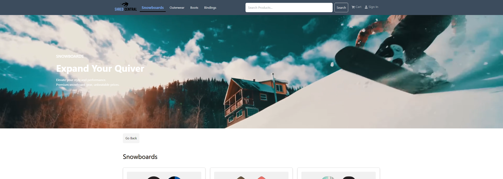

# Shred Central

This is an e-commerce website dedicated to snowboarding equipment. 

# Live Website (Deployed on Render)

Live: <a>shredcentral.store</a>

## Features

- Browse a wide variety of snowboarding equipment with categorical filter and search.
- Add items to your cart and purchase with PayPal integration.
- User authentication system through JWT.
- Admin system to add, delete, and modify all products, users, and orders.
- Responsive design that works on mobile, tablets, and desktop browsers

# How to run project on localhost

- git clone https://github.com/NotKhoa03/snowboarding-ecommerce-web.git 
- Open terminal and use "npm install" in the root. Import seeder data with "npm run data:import".
- cd to frontend and use "npm install".
- cd back into the root and run "npm run dev".
- Replace example.env with your environment variables.

## License

[MIT](https://choosealicense.com/licenses/mit/)